# Solar System Proportions

Below is a collection of curious proportions in our solar system. Some pictures and ideas taken from https://joedubs.com.

Müller H. (2019), [The Physics of Transcendental Numbers](http://www.ptep-online.com/2019/PP-58-02.PDF) argues that proportions like these are, in fact, transcendental numbers that happen to be well approximated by rational fractions.

## Earth and Moon

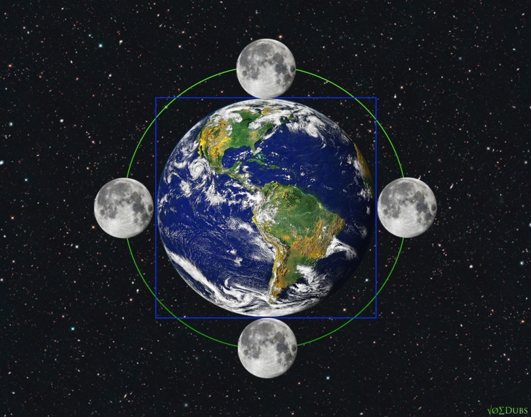

The green circle circumference is equal to the blue square perimeter:
- Earth diameter = 7920 miles.
- Moon diameter = 3/11 of Earth diameter = 2160 miles, with 99.98% accuracy.
- The perimeter = 4 D.
- The circumference = 14/11 π D = 4 D, with 3.5 sigma accuracy.

> To be pedantic, 14/11 π = 3.99839..., but Earth and Moon average diameters are approximate numbers, so there is no point in using 8 decimal digits of 14/11 π in calculations.

Btw, it's well known that one [mean tropical] year takes 365.242 days. It's less known that the Earth circumference at the equator is 365.242 x 360,000 feet. That's the reason I'm sticking to the imperial units (miles, feet, inches) here.

## Mercury and Earth

The picture below is a bit too artistic to my taste, but it explains the proportions well.

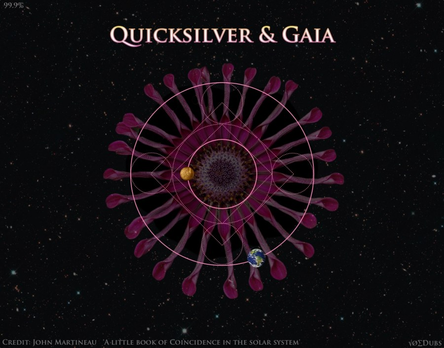

Start the Mercury's orbit, put it into a square, and that square into another circle, and that circle in another square.

- Sun diameter = S = 0.864 million miles.
- Mean distance to Earth = E = 107.6 S.
- Mean distance to Mercury = M = 41.64 S = diameter of the inner circle.
- Diameter of the middle circle = C1 = 2 sqrt(2) M.
- Diagonal of the outer square = C2 = 4 M.
- Diameter of each of the 4 small circles = C3 = C2 - C1.
- Radius of the outer circle = R = C1 + 2 C3 = 2 C2 - C1 = (4 - sqrt(2)) M = 107.7 S.

So the outer circle indeed matches the Earth orbit with 3 sigma accuracy.

Another curious proportion:

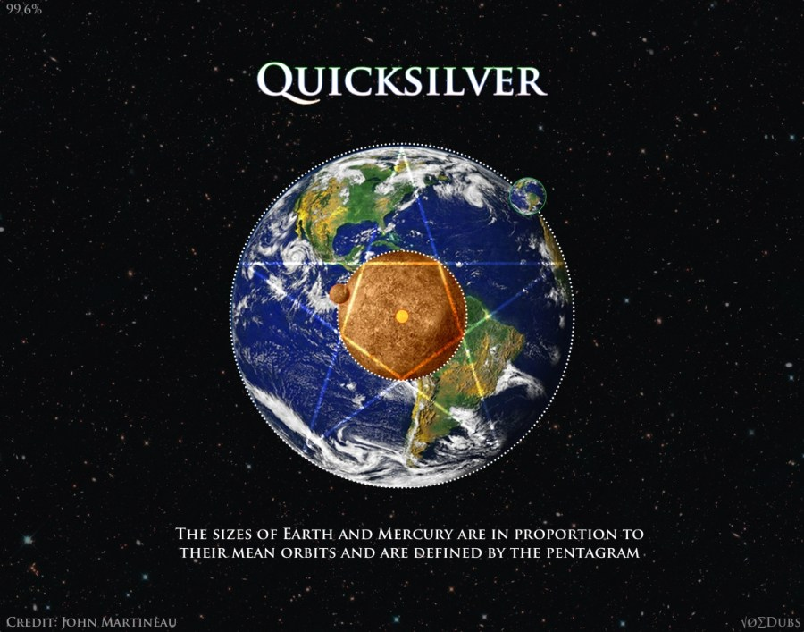

Relative proportions of the two planets are also interesting.

- Re = radius of Earth = 3960 miles.
- Rm = radius of Mercury = 1516 miles.
- P = the inner [pentagon radius](https://mathworld.wolfram.com/Pentagram.html) = 1/(Φ+1) of the outer pentagon radius.

Rm / Re = 0.382828 = P with 0.2% error margin.

## Saturn and Neptune

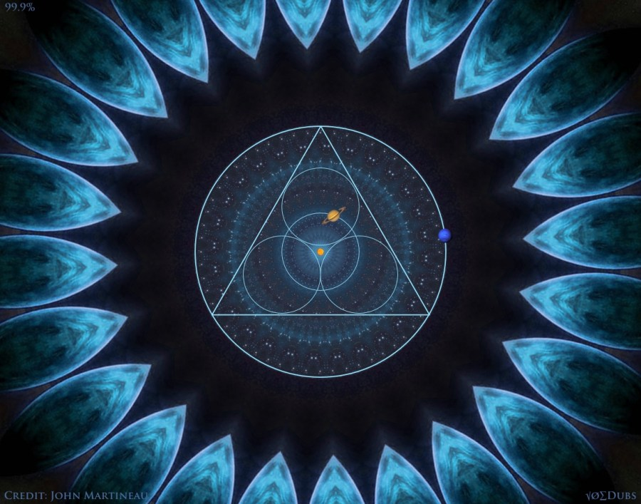

- Distance to Earth = 1 Au
- Mean distance to Saturn = Rs = 9.5303 Au (see [NASA](https://solarsystem.nasa.gov/planets/neptune/in-depth/)).
- Mean distance to Neptune = Rn = 30.12 Au = 3.1604 Rs.
- Radius of the outer circle = C = (2/sqrt(3) + 2) Rs = 3.1547 Rs.

So the outer circle indeed matches the Neptune orbit, but with error margin of 0.2% or 3 sigma.

## Jupiter and Mars

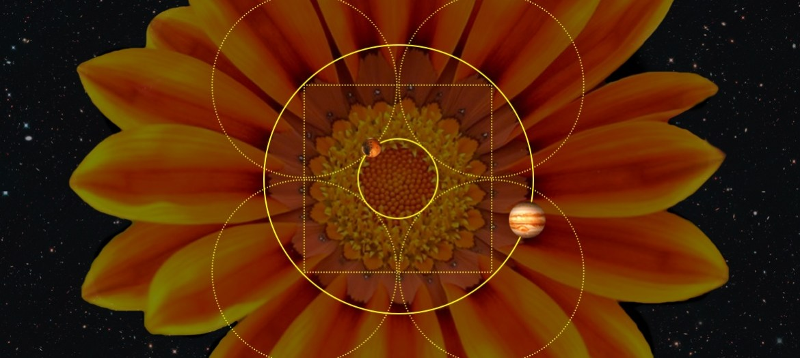

- J = distance to Jupiter = 484 million miles.
- M = distance to Mars = 142 million miles = 0.2934 J.
- R = radius of each of the 4 circles = 1/sqrt(2) J.
- C = radius of the inner circle = J - R = 0.2929 J.

Error margin: M/C - 1 = 0.2%.

## Venus and Mercury

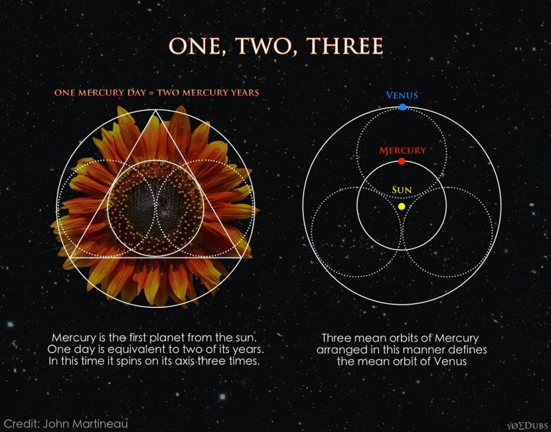

- V = distance to Venus = 67 million miles
- M = distance to Mercury = 36 million miles.

V = (1 + sqrt(3)/2) M with 0.3% accuracy.

## Sun, Moon, Earth and Jupiter

It's well known that Moon almost perfectly eclipses Sun, but there are a few more curious proportions involving Earth, Moon and Sun.

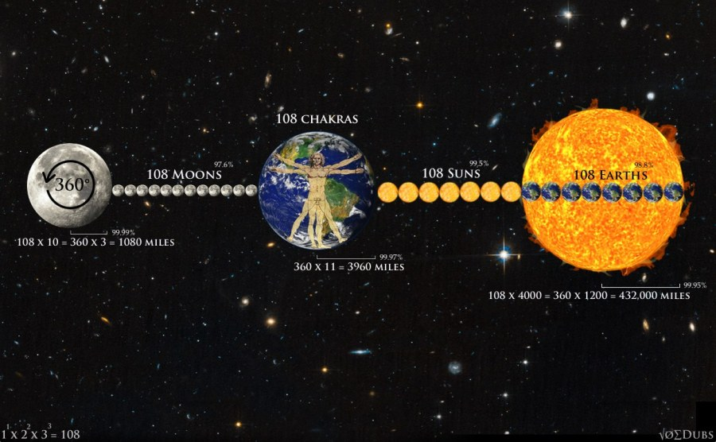

- E = Earth diameter = 7920 miles.
- M = Moon diameter = 3/11 E · 0.9998.
- S = Sun diameter = 864,000 miles = 400 M = 108 E · 1.01.
- Rm = mean distance to Moon = 237,674 miles = 30 E · 1.0003 = 108 M · 1.02.
- Re = mean distance to Earth = 92,955,807 miles = 108 S · 0.996 = 400 Rm · 0.98.

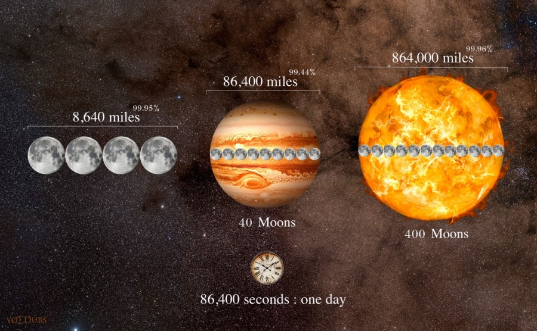

## Uranus and Earth

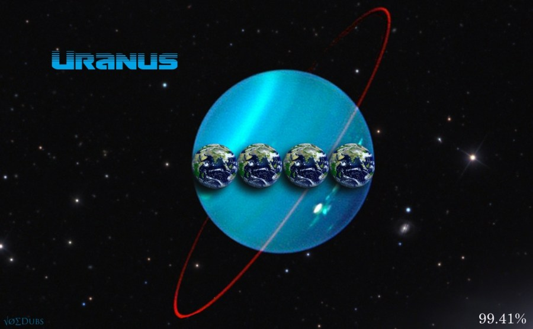

- U = Uranus diameter = 31,518 miles.
- E = Earth diameter = 7,920 miles
- U/E = 4 · 0.995.

## Neptune and Venus

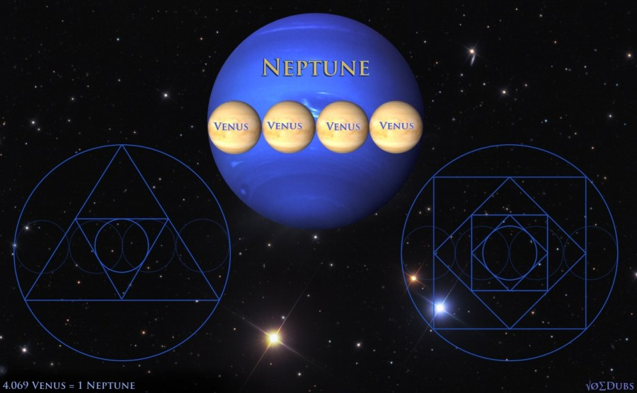

- N = Neptune diameter = 30,605 miles.
- E = Earth diameter = 7,920 miles.
- N/E = 4 · 0.97.

## Saturn and Mars

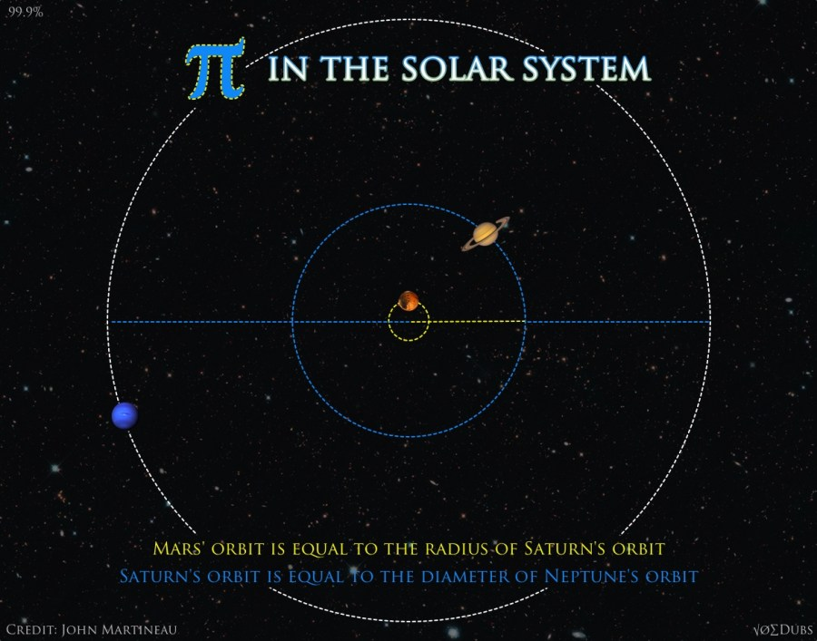

- S = mean distance from Sun to Saturn = 9.5826 Au.
- M = mean distance from Sun to Mars = 1.5237 Au.
- S / M = 2π · 1.0009.
